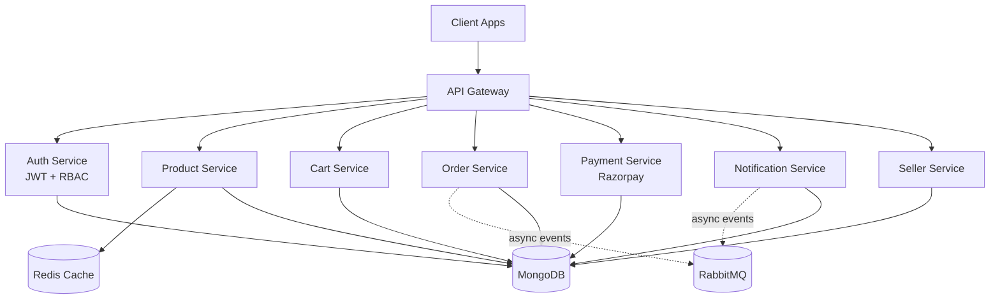

<p align="center">
  
</p>

<p align="center">
  
  
  
  
</p>

<p align="center">
  <a href="#-overview">Overview</a> •
  <a href="#-features">Features</a> •
  <a href="#-tech-stack">Tech Stack</a> •
  <a href="#-architecture">Architecture</a> •
  <a href="#-getting-started">Getting Started</a> •
  <a href="#-cicd-pipeline">CI/CD</a> •
  <a href="#-roadmap">Roadmap</a>
</p>

---

## 📖 Overview

**EverCart** is a microservices-based e-commerce backend, built to reflect how
real production systems are structured — not another single-file CRUD app.
The platform is split into independent services for Authentication, Products,
Orders, Cart, Payments, Notifications, and Seller Management, all routed
through a custom-built **API Gateway**, containerized with **Docker**, and
deployed on **AWS** with an automated **CI/CD pipeline**.

---

## ✨ Features

<table>
<tr>
<td width="50%">

**🧩 Microservices Architecture**
Independent services for Auth, Products, Orders, Cart, Payments, Notifications & Sellers

**🚪 Custom API Gateway**
Centralized request routing, authentication, authorization & rate limiting

**🔐 JWT Auth + RBAC**
Access & refresh tokens with Role-Based Access Control

</td>
<td width="50%">

**⚡ Redis Caching**
Faster response times for frequently-accessed data

**📨 RabbitMQ Messaging**
Asynchronous, event-driven communication between services

**💳 Razorpay Integration**
Secure, production-ready payment processing

</td>
</tr>
</table>

**🐳 Dockerized Services** — every service runs in its own container for easy scaling and isolation
**☁️ Deployed on AWS (EC2)** — real cloud infrastructure, not just localhost
**🔁 Automated CI/CD** — GitHub Actions pipeline tests and deploys on every push

---

## 🛠️ Tech Stack

<p align="center">
  
</p>

| Category | Stack |
|---|---|
| **Runtime & Framework** | Node.js, Express.js |
| **Database** | MongoDB |
| **Caching** | Redis |
| **Messaging** | RabbitMQ |
| **Auth** | JWT (Access + Refresh Tokens), RBAC |
| **Payments** | Razorpay |
| **Containerization** | Docker |
| **Cloud** | AWS (EC2) |
| **CI/CD** | GitHub Actions |

---

## 🧩 Architecture



*(Renders natively on GitHub — no external image dependency.)*

---

## 🚀 Getting Started

```bash
# 1. Clone the repo
git clone https://github.com/sahil-kourav/evercart_marketplace.git
cd evercart_marketplace

# 2. Install dependencies
cd server && npm install
cd ../client && npm install

# 3. Set environment variables
cp .env.example .env
# Fill in: MONGODB_URI, JWT_SECRET, JWT_REFRESH_SECRET,
# RAZORPAY_KEY_ID, RAZORPAY_KEY_SECRET, REDIS_URL, RABBITMQ_URL

# 4. Run with Docker (recommended)
docker-compose up --build

# Or run services manually
cd server && npm run dev
cd ../client && npm run dev
```

---

## 🔁 CI/CD Pipeline

This project uses **GitHub Actions** to automatically test and deploy on every
push to `main` — no manual deployment steps required.

```yaml
# .github/workflows/deploy.yml (simplified)
on:
  push:
    branches: [main]
jobs:
  build-and-deploy:
    runs-on: ubuntu-latest
    steps:
      - uses: actions/checkout@v4
      - run: npm install
      - run: npm test
      - run: npm run build
      # ... deployment step to AWS
```

---

## 🗺️ Roadmap

- [x] Microservices architecture with API Gateway
- [x] JWT authentication with RBAC
- [x] Redis caching + RabbitMQ event-driven messaging
- [x] Razorpay payment integration
- [x] Dockerized services deployed on AWS
- [x] CI/CD pipeline with GitHub Actions
- [ ] Add centralized logging & monitoring

---

## 📫 Contact

<p align="center">
  <a href="https://linkedin.com/in/sahilkourav"></a>
  <a href="mailto:sahilkourav02@gmail.com"></a>
</p>


